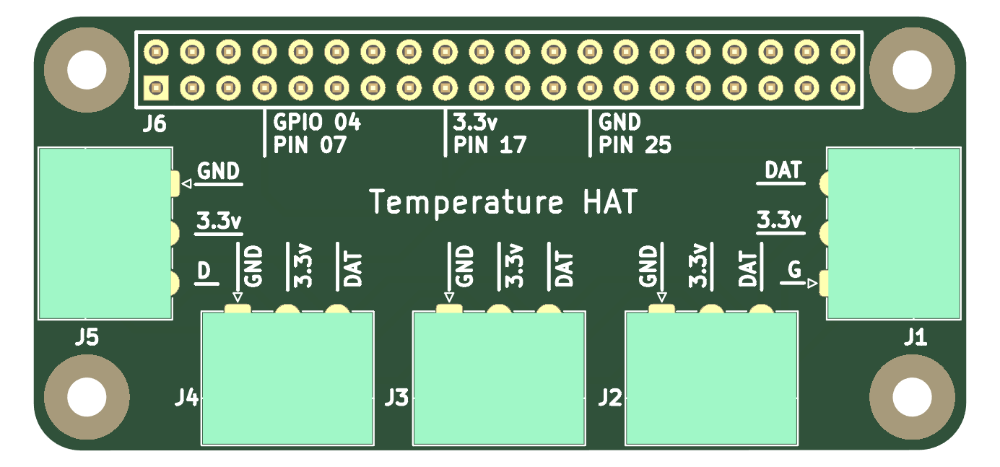
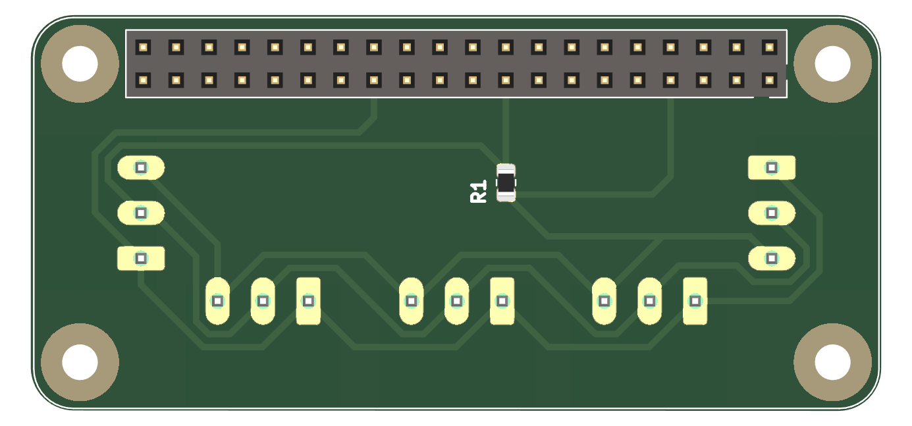

# Project pcb-hat-thermo

Goal of this project is to design Raspberry Pi Zero extension HAT to support DS18B20 senzor based thermometers that are using 1-wire protocol via GPIO 04.

Intended HAT needs to be stackable and compatible with other modules unless they are using GPIO 04 PIN.

The cirquit is using Pull-Up resistor R1 to deliver 3.3v voltage, generating logical 1 value on DATA pin. In order to generate logical 0 value, the temperature sensor will short the DATA pin to ground and deliver 0v voltage on DATA pin. Because direct wiring between DATA pin and 3.3v might damage Raspberry Pi, we are using resistore R1 10kΩ to reduce electrical current to acceptable value of 0.33 mA (maximum is 0.5 mA).

```text
Current (A) = Voltage (V) / Resistency (R) = 3.3V / 10000Ω = 0.00033 A = 0.33 mA
```

Reference architecture for this design is based on following article and associated cabling diagram.

- [Raspberry Pi DS18B20 Temperature Sensor Tutorial](https://www.circuitbasics.com/raspberry-pi-ds18b20-temperature-sensor-tutorial/)


This PCB is designed in [KiCad](https://www.kicad.org) 6.0.1-0.

## Logical Design

Following picture is capturing logical design.


There are five Phoenix Horizontal 1x03 P3.50mm connectors on the board, each with following connectivity:

- GND - Ground, connected to PIN 25
- 3.3v - VCC power 3.3v, connected to PIN 17
- DAT - Data, 1-wire protocol data connected to PIN 07 (GPIO 04)

Since the 1-wire protocol is addressable, all connectors are wired in chain, having Pull-Up resistor R1 10kΩ between DAT and 3.3v links.

Resistor R1 is 10kΩ SMD resistor with form factor [0805](https://en.wikipedia.org/wiki/List_of_integrated_circuit_packaging_types#Rectangular_passive_components).

## Physical Design

Pictures below are visualizing the final PCB as designed in KiCad.





Source files, including `kicad_pcb` are in the [KiCad/pcb-hat-thermo](KiCad/pcb-hat-thermo) directory.

## Contributing

This is open source project based on Eclipse public license. Any feedback, suggestions, correction or any other contributions are highly welcomed.
